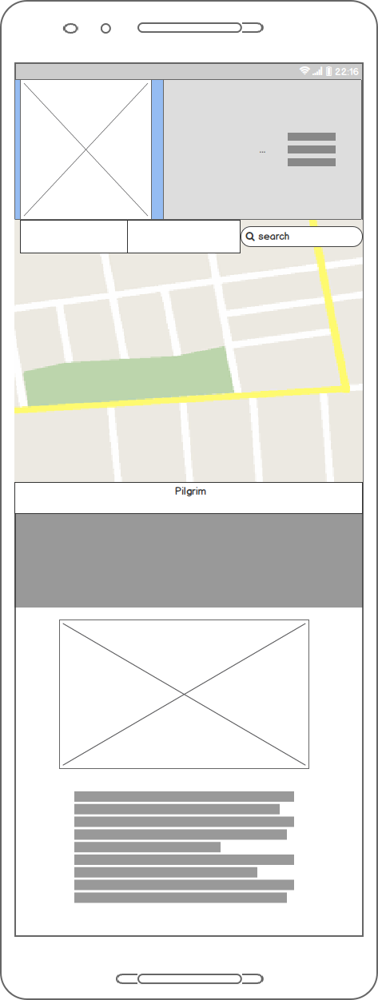
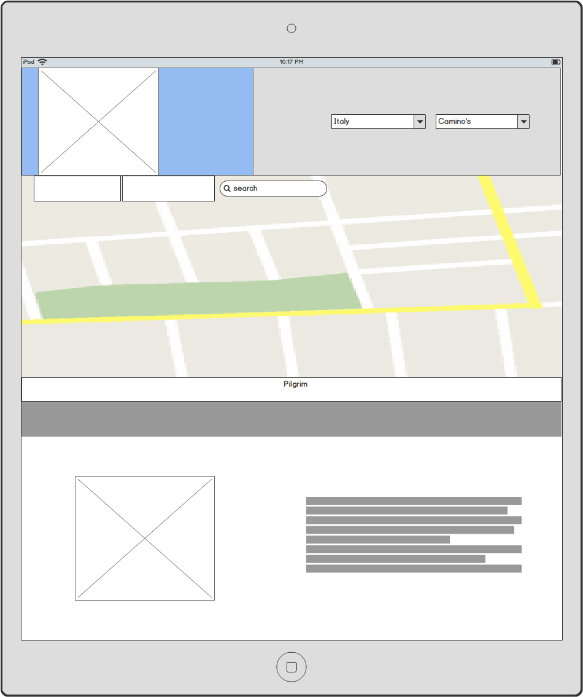
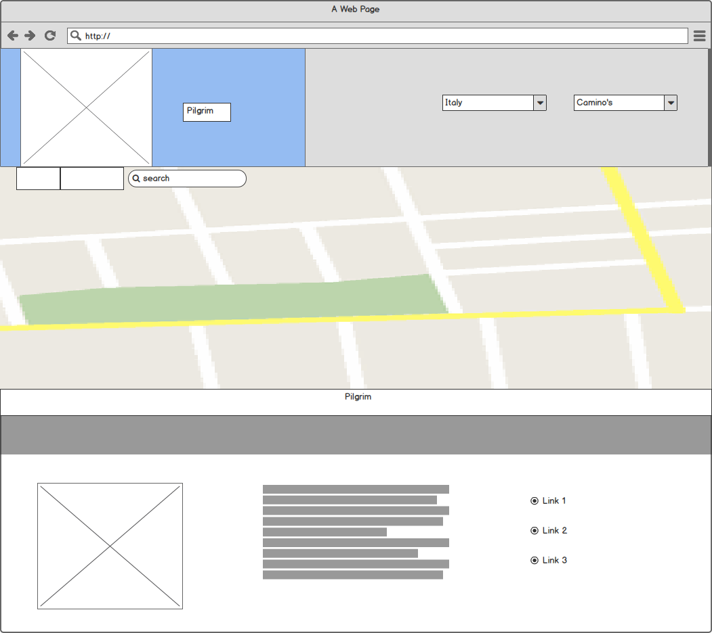

                        
 #   Pilgrim
                        

 
 [Link to the website](https://decline-of-mind.github.io/Pilgrim/)
 ## Mission
 Since one of the most memorable trips I have made was a pilgrimage in Spain(Camino Primitivo), I thought it would be great to create a hub where people can be tempted to try the same. There is loads of information about these walking routes, however, it is all scattered pieces of information over different websites, most of them in different languages. This is how Pilgrim came to be. Centralization of information, ease in trying to discover new routes and a UI that isn't too stale or too flashy.
 
 ---
 ### The target audience:
 
 The funny thing about the pilgrimages is that you'll find loads of different kinds of people all doing the same thing. That is half the fun! However, in the time of Instagram and Tiktok, it's the younger generation that tends not to know about these routes. They get swamped in information and distractions, so the information on the website needs to be transparent and upfront with what it wants to show. Certainly, with the information being so dispersed, that leaves a job to be filled. It also helps that you don't have to spend a lot of money if you don't want to.

Another big issue of our times is mental health. One of the best remedies to depression is walking/moving and sunlight. That, along with the effect of a tired body because of physical activities and working towards a goal (hopefully the end of the route) do wonders for the mind. Combine that with wonderful people to be met on the way and it's a perfect storm to get you out of that rut.

Of course, the routes are a logical destination for religious pilgrims, nature/culture enthusiasts and travellers who like a physical challenge.

### TL:DR
#### Target Audience
* 20-30 year olds, student and starters.
* People who'd like to get a little away time from society
* Culture Enthusiasts
* Nature Enthusiasts
* Goal-Oriented people who like a challenge
 
 ### Welcoming the User
 The moment the user enters the page he/she will right away notice the map in the middle of the page. Right away questions will arise, "what is this for?" Not only do we indicate by text to go to the buttons at the top of the page, the page is structured so easily that in case the user wants to interact with the map, he/she is never more than 2 steps away from doing so. Although there is a piece of text at the bottom of the page containing some information and storytelling elements about the Camino's, it's not a priority. The user can find all this at their own pace.
 
------ 
## User Experience
 Pilgrim tries to keep the User Experience as simple as pleasant as possible. Not too many options to go in. One could say the site is quite static and empty without interaction. That is as intended. The moment the user makes decisions is the moment information should pop up. To keep things clear only already existing elements on the website change. We do not add new ones. 
Some examples of how we keep it simple: 

* Routes on top are comprised of multiple sections, visible by the icon next to the encompassing name
* Dropdown menu on the mobile viewport
* Upon clicking one of the routes,  markers appear on the map, and the camera pans towards the route.
* Picture and text beneath the map change depending on the route. The picture remains the same size and the text the same colour.

## User Stories

As a user interested in pilgrimage, I expect to see the religious connotations of the routes and stories around them.

As a user interested in travel, I expect to see where te route leads and what i will encounter on that route.

As a user interested in a physical challenge, I expect to see how many stops the route has and read about the terrain.

----

## Wireframes

Mobile view: 


Ipad view: 


Desktop view 


-------

## Features
* __Logo:__ Gives colour to the website and is used as a return function
* __Map:__ Google maps allows the user to look at the world
* __Search:__ Able to search for places in the search bar
* __Autocomplete:__ Gives option for auto-completion while typing in a search
* __Bound change:__ Bounds automatically change to fit the search
* __Zooms:__ Automatically zooms in search address
* __Places:__ Shows interesting places around a search or when a user zooms in on the world (also on route markers)
* __Infowindow:__ Creates an info window on a place when clicked, containing information provided by Google Place API
* __Call Route:__ Calls route markers on the map when the route is clicked on the website
* __Custom Infowindow:__ Created for the routes, these infowindows show the city name and hold a "go to: city" function
* __Pan to Route:__ Upon clicking a route, the bounds of the map automatically change to fit the route.
* __Delete Marker:__ Upon a new search or clicking a new route, the previous markers disappear
* __Street view:__ Able to see how a place or route looks at street level
* __Changing image:__ Image changes on clicking a route to give the user a taste what it's like
* __Changing text:__ Text on the website changes depending on route, as to give a fitting story to that route

### Features Left to Implement

* Showing the route in lines on the map. PolyLines were tried but were ineffective.
* Showing days needed to complete the route
* Creating a benchmark to rank the routes on difficulty and then creating a function to show it
* Comments and tips from pilgrims about the route
* More Routes!

## Technologies Used

* ### Languages
    * #### [HTML](index.html)
    * #### [CSS](assets/css/style.css)
    * #### [JavaScript](assets/js/maps.js)
      * Initializing Google Maps and creating functions to create features on Google Maps 
    * #### [Jquery](https://jquery.com/)
      * Navigate the DOM more easily and connects Javascript functions to HTML elements
    * #### [Popper.js](https://popper.js.org/)
      * Needed for CSS dropdowns
* ### Framework
    * #### [Bootstrap](https://getbootstrap.com/)
      * Used for responsive layout and basic styles
* ### Resources
    * #### [Google Fonts](https://fonts.google.com/)
       * Font Styles
    * #### [Google Maps JavaScipt API](https://developers.google.com/maps/documentation/javascript/tutorial?hl=nl)
        * World map
    * #### [Google Places API](https://cloud.google.com/maps-platform/places?hl=en)
        * Gets coordinates, icons and infowindows with data for places on the map
    * #### [JSHint](https://jshint.com/)
        * Used to check Javascript code for mistakes, inconsistencies or typo's
    * #### [W3 Validator, HTML](https://validator.w3.org/#validate_by_input)
        * Used to check HTML code for mistakes, inconsistencies or typo's
    * #### [W3 Validator, CSS](https://jigsaw.w3.org/css-validator/)
         * Used to check CSS code for mistakes, inconsistencies or typo's
## Testing (taken from User Experience)
### Answering the questions:
### As a user interested in pilgrimage, I expect to see the religious connotations of the routes and stories around them.
**I entered the website, and clicked on a route. The text at the bottom of the place explained to me what the religious story is about the route and it's ending.**
### As a user interested in travel, I expect to see where the route leads and what i will encounter on that route.
**I entered the website, clicked on a route and saw markers pop-up. Upon clicking them i saw the name and the option to zoom in. That showed me different places to visit inside the city.**
### ser interested in a physical challenge, I expect to see how many stops the route has and read about the terrain.
**I entered the website and clicked different routes. I could count the markers to see how many days i would be spending on the trip and i could read about the difficulty in the text beneath.**

In order to not get an error when a user o=puts something in the search bar without geometry, the Search Places has the following action:
```javascript
            if (!place.geometry) {
                console.log("Returned place contains no geometry");
                return;
            }
```
In the process of making the project, PolyLines was created on the map where the route would lie. This unfortunately didn't have the desired result aesthetically and it managed to distort the variables also needed for AddMarkers() function. Upon realizing that the remove marker action inside the searches function started deleting all routes, even when clicked, An overhaul was added. The remove marker action of the search function was made into its separate function, to be called upon when a new route was clicked or when the Search places counted more than two markers on the map.
```javascript
function clearMarkers() {
    addedMarkers.forEach(function (m) {
        m.setMap(null);
    });
    addedMarkers = [];
```
Most of the variables tied to the routes are hardcoded and won't be able to fail. 
The Javascript, HTML and CSS have all been tested. Find the links at Technologies Used: resources.
      
## Deployment

1. Set up a git hub repository.
2. Pushed the master branch to the Github Repository. The site will update automatically from the master branch.
3. Validate and test HTML, CSS and Javascript.
4. Go to the settings of the repository and select the Github pages section.
5. Published the site from the master branch, ensure index.html is the landing page.

### User Deployment
  1. Download Master Branch
  2. Unzip contents in a folder
  3. Open up index,html in a browser. The site will be private and functioning `
  
To run this code locally, you can clone this repository by clicking the clone button on the repository or by typing `git clone https://github.com/Decline-of-Mind/Pilgrim` into the terminal. To disconnect from this repository, type `git remote rm origin` into the terminal.

## Credits
### Content:
The place-names of all the stops on the routes were double-checked on this website, and some of the text needed with the routes was translated (by me) and paraphrased. https://www.pelgrimroutes.nl/

### API's:
Some code snippets needed to work with the Google Maps JavaScript API were copied from their documentation. Although most code was arranged, written and formatted by the developer, Google was often the source of help or inspiration.

## Media:
### Logo
The logo was created by Vitorio Rooderkerk, IT student at Windesheim University in Zwolle and a photography/graphic design enthusiast. 
(Website to be added when he finishes it)

### Photo's
The photo's used beneath the map in the index.html were taken from **[Unsplash](https://unsplash.com/)

*  **John Tyson: - pilgrim.jpg**
*  **Alex Holyoake - roma.jpg**
*  **Nils Schirmer - umbria-south.jpg**
*  **Monique Kraan - tuscany.jpg**
*  **Heidi Kaden - florence.jpg**
*  **Les Routes Sans Fin - primitivo.jpg**
*  **Juan Manuel Martinez - norte.jpg**
*  **Kylie Paz: - frances.jpg**
  
### Acknowledgements
* I would like to thank the tutoring team of **[CodeInstitute](https://codeinstitute.net/)** for aiding me in this project.
* Secondly my mentor: __Aaron Sinnott__ for thinking with me and giving me advice on my code.
* Third my cousin: __Tristan Versteeg__  for telling me to clean up my code and teaching me a lot in the process.

## DISCLAIMER
Please note the content and images on this website are for educational purposes only.
 [Link to the website](https://decline-of-mind.github.io/Pilgrim/)

